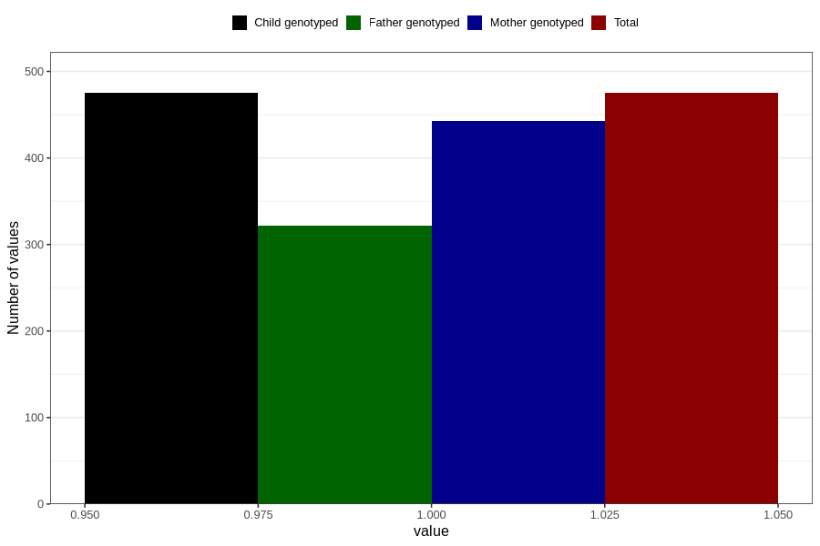

# testicles_not_descended_scrotum_previous_3y
Variable mapping to `GG67` in `Skjema6_3aar_v12`.
- Number of values:

| Value | Total | Child genotyped | Mother genotyped | Father genotyped |
| ----- | ----- | --------------- | ---------------- | ---------------- |
| Missing | 80331 | 80331 | 75581 | 52841 |
| Non-missing | 475 | 475 | 443 | 322 |
| 1 | 475 | 475 | 443 | 322 |

