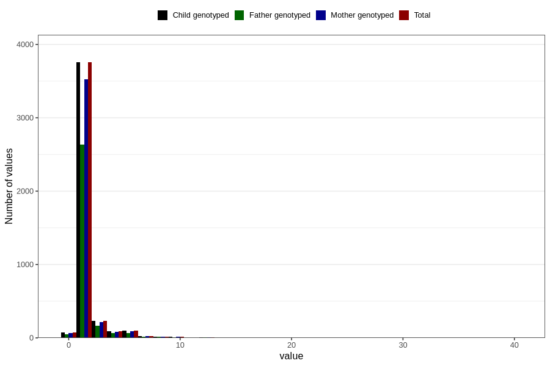

# throat_infection_confirmed_streptococci_freq_3y
Variable mapping to `GG132` in `Skjema6_3aar_v12`.
- Number of values:

| Value | Total | Child genotyped | Mother genotyped | Father genotyped |
| ----- | ----- | --------------- | ---------------- | ---------------- |
| Missing | 76492 | 76492 | 71975 | 50139 |
| Non-missing | 4314 | 4314 | 4049 | 3024 |
| 0 | 72 | 72 | 68 | 48 |
| 1 | 3030 | 3030 | 2850 | 2144 |
| 2 | 725 | 725 | 676 | 492 |
| 3 | 233 | 233 | 219 | 164 |
| 4 | 89 | 89 | 78 | 64 |
| 5 | 57 | 57 | 55 | 36 |
| 6 | 39 | 39 | 37 | 26 |
| 7 | 21 | 21 | 20 | 14 |
| 8 | 16 | 16 | 15 | 15 |
| 10 | 16 | 16 | 15 | 10 |
| 11 | 1 | 1 | 1 | 1 |
| 12 | 4 | 4 | 4 | 3 |
| 13 | 2 | 2 | 2 | 2 |
| 14 | 3 | 3 | 3 | 2 |
| 15 | 2 | 2 | 2 | 2 |
| 20 | 2 | 2 | 2 | 0 |
| 21 | 1 | 1 | 1 | 1 |
| 40 | 1 | 1 | 1 | 0 |

