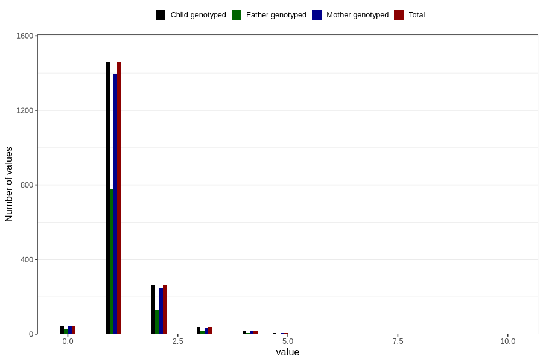

# throat_infection_number_12_18m
Variable mapping to `EE223` in `Skjema5_18mnd_v12`.
- Number of values:

| Value | Total | Child genotyped | Mother genotyped | Father genotyped |
| ----- | ----- | --------------- | ---------------- | ---------------- |
| Missing | 78966 | 78966 | 74267 | 52201 |
| Non-missing | 1840 | 1840 | 1757 | 962 |
| 0 | 45 | 45 | 43 | 27 |
| 1 | 1461 | 1461 | 1398 | 776 |
| 2 | 265 | 265 | 250 | 130 |
| 3 | 39 | 39 | 36 | 17 |
| 4 | 18 | 18 | 18 | 7 |
| 5 | 5 | 5 | 5 | 2 |
| 6 | 4 | 4 | 4 | 2 |
| 7 | 1 | 1 | 1 | 0 |
| 10 | 2 | 2 | 2 | 1 |

