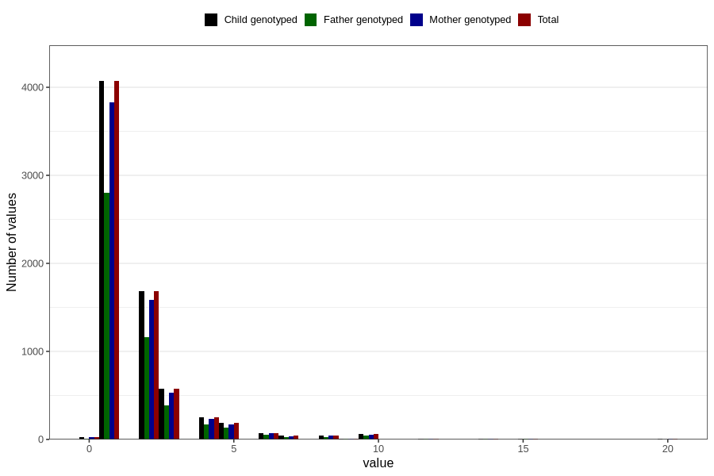

# throat_infection_other_freq_3y
Variable mapping to `GG135` in `Skjema6_3aar_v12`.
- Number of values:

| Value | Total | Child genotyped | Mother genotyped | Father genotyped |
| ----- | ----- | --------------- | ---------------- | ---------------- |
| Missing | 73760 | 73760 | 69403 | 48312 |
| Non-missing | 7046 | 7046 | 6621 | 4851 |
| 0 | 24 | 24 | 22 | 12 |
| 1 | 4070 | 4070 | 3831 | 2806 |
| 2 | 1680 | 1680 | 1584 | 1165 |
| 3 | 573 | 573 | 532 | 389 |
| 4 | 251 | 251 | 235 | 168 |
| 5 | 188 | 188 | 172 | 133 |
| 6 | 74 | 74 | 73 | 52 |
| 7 | 42 | 42 | 37 | 30 |
| 8 | 43 | 43 | 41 | 26 |
| 9 | 6 | 6 | 6 | 4 |
| 10 | 61 | 61 | 57 | 46 |
| 11 | 2 | 2 | 2 | 0 |
| 12 | 9 | 9 | 9 | 6 |
| 13 | 1 | 1 | 1 | 1 |
| 14 | 6 | 6 | 4 | 4 |
| 15 | 8 | 8 | 7 | 6 |
| 18 | 1 | 1 | 1 | 0 |
| 20 | 7 | 7 | 7 | 3 |

