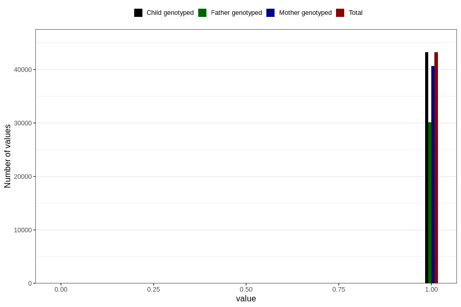

# trouble_relating_to_others_no_3y
Variable mapping to `GG578` in `Skjema6_3aar_v12`.
- Number of values:

| Value | Total | Child genotyped | Mother genotyped | Father genotyped |
| ----- | ----- | --------------- | ---------------- | ---------------- |
| Missing | 37570 | 37570 | 35366 | 23014 |
| Non-missing | 43236 | 43236 | 40658 | 30149 |
| 0 | 20 | 20 | 19 | 14 |
| 1 | 43216 | 43216 | 40639 | 30135 |

