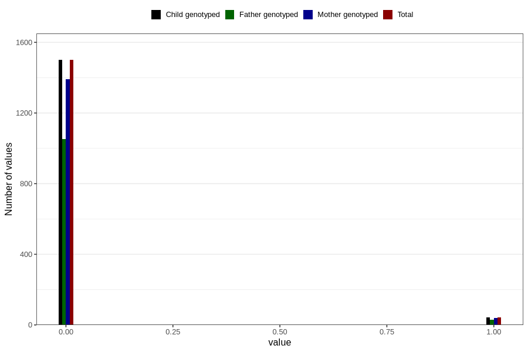

# trouble_relating_to_others_previous_3y
Variable mapping to `GG580` in `Skjema6_3aar_v12`.
- Number of values:

| Value | Total | Child genotyped | Mother genotyped | Father genotyped |
| ----- | ----- | --------------- | ---------------- | ---------------- |
| Missing | 79262 | 79262 | 74594 | 52081 |
| Non-missing | 1544 | 1544 | 1430 | 1082 |
| 0 | 1500 | 1500 | 1391 | 1053 |
| 1 | 44 | 44 | 39 | 29 |

