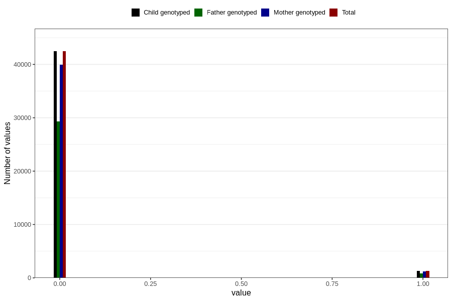

# underweight_3y
Variable created during phenotype curation.
- Number of values:

| Value | Total | Child genotyped | Mother genotyped | Father genotyped |
| ----- | ----- | --------------- | ---------------- | ---------------- |
| Missing | 37047 | 37047 | 34854 | 22930 |
| Non-missing | 43759 | 43759 | 41170 | 30233 |
| 0 | 42456 | 42456 | 39964 | 29366 |
| 1 | 1303 | 1303 | 1206 | 867 |

