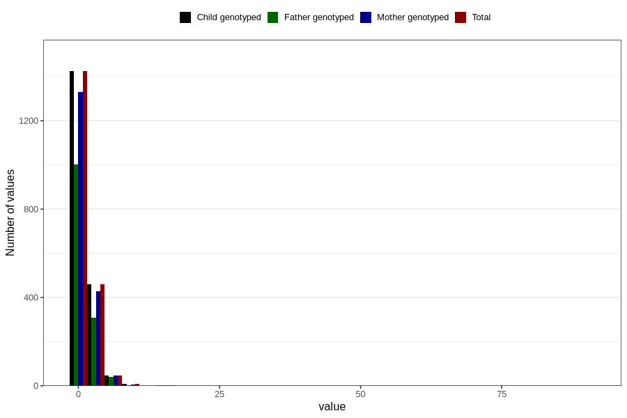

# urinary_tract_infection_freq_3y
Variable mapping to `GG153` in `Skjema6_3aar_v12`.
- Number of values:

| Value | Total | Child genotyped | Mother genotyped | Father genotyped |
| ----- | ----- | --------------- | ---------------- | ---------------- |
| Missing | 78863 | 78863 | 74206 | 51807 |
| Non-missing | 1943 | 1943 | 1818 | 1356 |
| 0 | 42 | 42 | 41 | 28 |
| 1 | 1382 | 1382 | 1290 | 973 |
| 2 | 302 | 302 | 283 | 203 |
| 3 | 95 | 95 | 87 | 66 |
| 4 | 62 | 62 | 58 | 39 |
| 5 | 33 | 33 | 33 | 27 |
| 6 | 9 | 9 | 9 | 9 |
| 7 | 6 | 6 | 6 | 4 |
| 8 | 4 | 4 | 4 | 1 |
| 10 | 4 | 4 | 3 | 3 |
| 12 | 1 | 1 | 1 | 0 |
| 15 | 2 | 2 | 2 | 2 |
| 90 | 1 | 1 | 1 | 1 |

