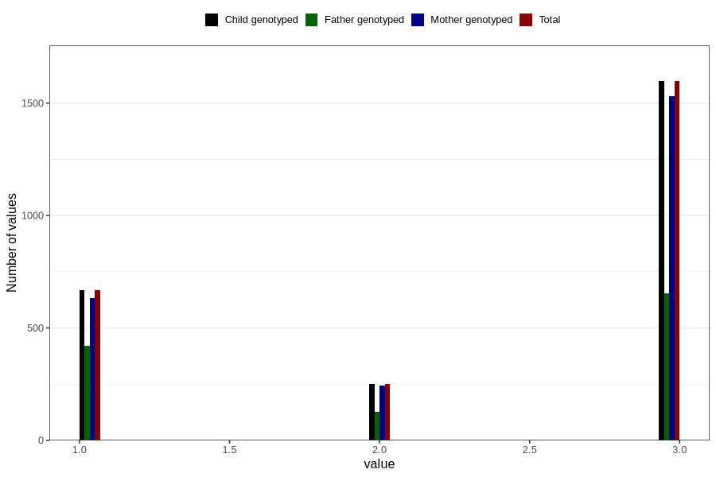

# vaccine_dt_freq_18m
Variable mapping to `EE154` in `Skjema5_18mnd_v12`.
- Number of values:

| Value | Total | Child genotyped | Mother genotyped | Father genotyped |
| ----- | ----- | --------------- | ---------------- | ---------------- |
| Missing | 78288 | 78288 | 73621 | 51960 |
| Non-missing | 2518 | 2518 | 2403 | 1203 |
| 1 | 669 | 669 | 631 | 422 |
| 2 | 252 | 252 | 242 | 127 |
| 3 | 1597 | 1597 | 1530 | 654 |

