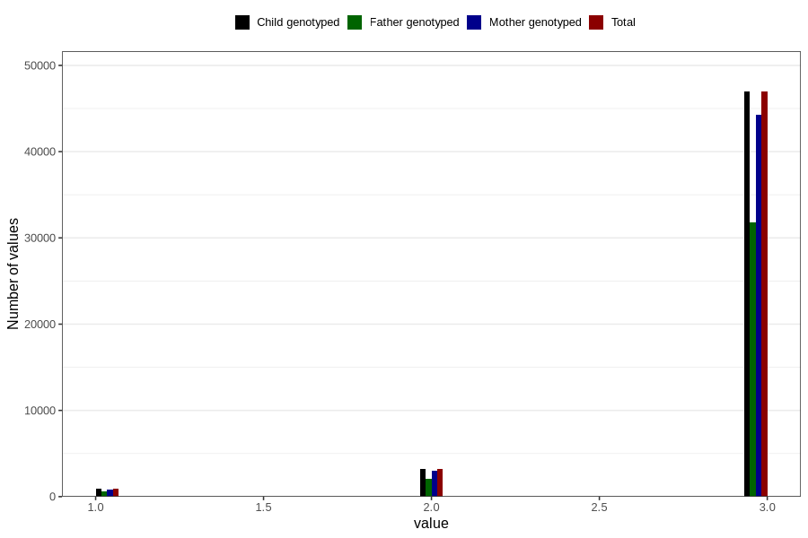

# vaccine_dtp_freq_18m
Variable mapping to `EE151` in `Skjema5_18mnd_v12`.
- Number of values:

| Value | Total | Child genotyped | Mother genotyped | Father genotyped |
| ----- | ----- | --------------- | ---------------- | ---------------- |
| Missing | 29737 | 29737 | 27915 | 18702 |
| Non-missing | 51069 | 51069 | 48109 | 34461 |
| 1 | 903 | 903 | 834 | 589 |
| 2 | 3218 | 3218 | 3029 | 2103 |
| 3 | 46948 | 46948 | 44246 | 31769 |

