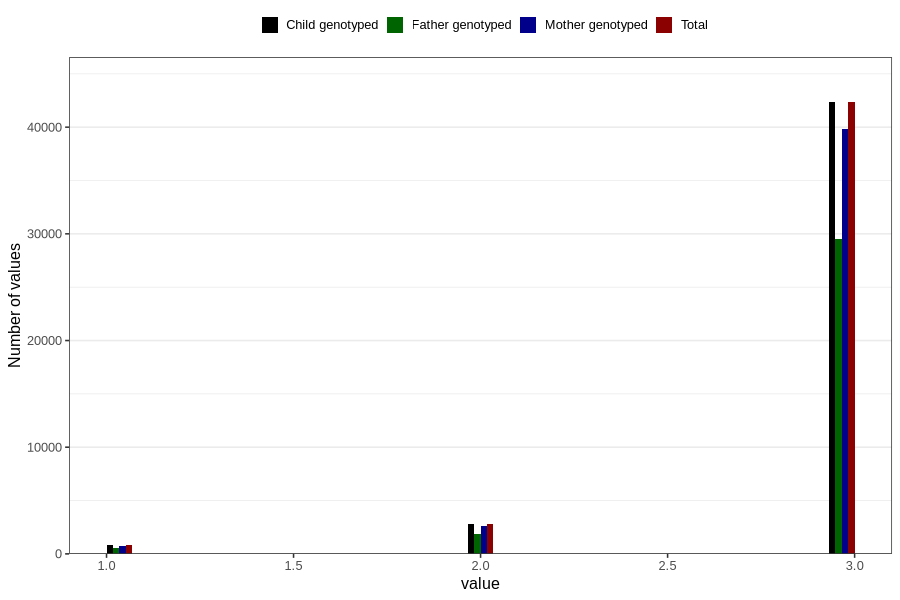

# vaccine_hib_freq_18m
Variable mapping to `EE784` in `Skjema5_18mnd_v12`.
- Number of values:

| Value | Total | Child genotyped | Mother genotyped | Father genotyped |
| ----- | ----- | --------------- | ---------------- | ---------------- |
| Missing | 34861 | 34861 | 32773 | 21177 |
| Non-missing | 45945 | 45945 | 43251 | 31986 |
| 1 | 825 | 825 | 768 | 557 |
| 2 | 2787 | 2787 | 2620 | 1877 |
| 3 | 42333 | 42333 | 39863 | 29552 |

