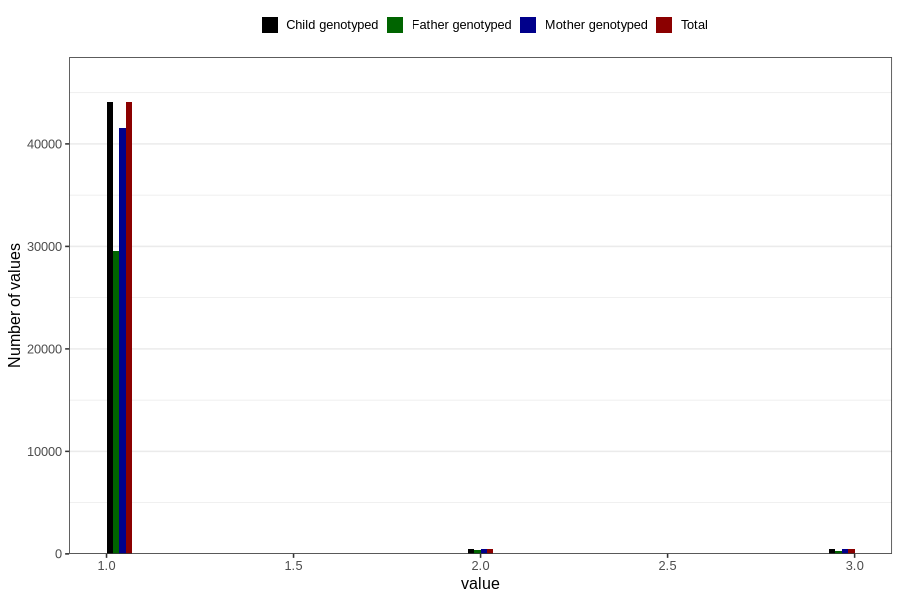

# vaccine_mmr_freq_18m
Variable mapping to `EE160` in `Skjema5_18mnd_v12`.
- Number of values:

| Value | Total | Child genotyped | Mother genotyped | Father genotyped |
| ----- | ----- | --------------- | ---------------- | ---------------- |
| Missing | 35709 | 35709 | 33536 | 22934 |
| Non-missing | 45097 | 45097 | 42488 | 30229 |
| 1 | 44060 | 44060 | 41521 | 29567 |
| 2 | 517 | 517 | 489 | 335 |
| 3 | 520 | 520 | 478 | 327 |

