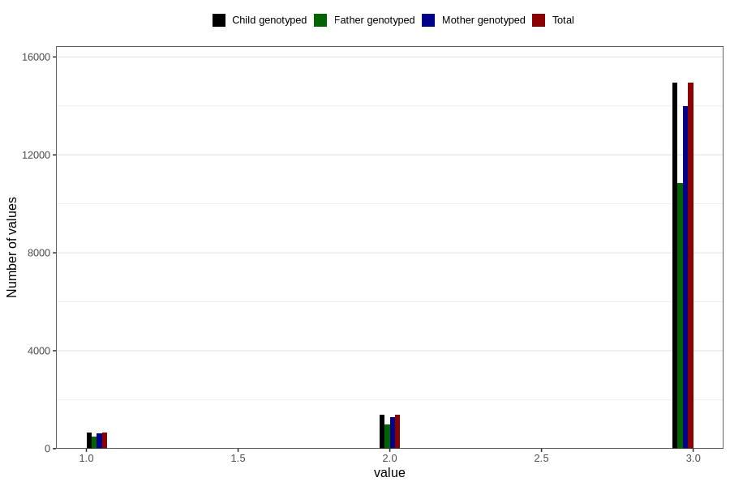

# vaccine_pneumococcus_freq_18m
Variable mapping to `EE1009` in `Skjema5_18mnd_v12`.
- Number of values:

| Value | Total | Child genotyped | Mother genotyped | Father genotyped |
| ----- | ----- | --------------- | ---------------- | ---------------- |
| Missing | 63811 | 63811 | 60103 | 40831 |
| Non-missing | 16995 | 16995 | 15921 | 12332 |
| 1 | 669 | 669 | 618 | 478 |
| 2 | 1384 | 1384 | 1302 | 994 |
| 3 | 14942 | 14942 | 14001 | 10860 |

