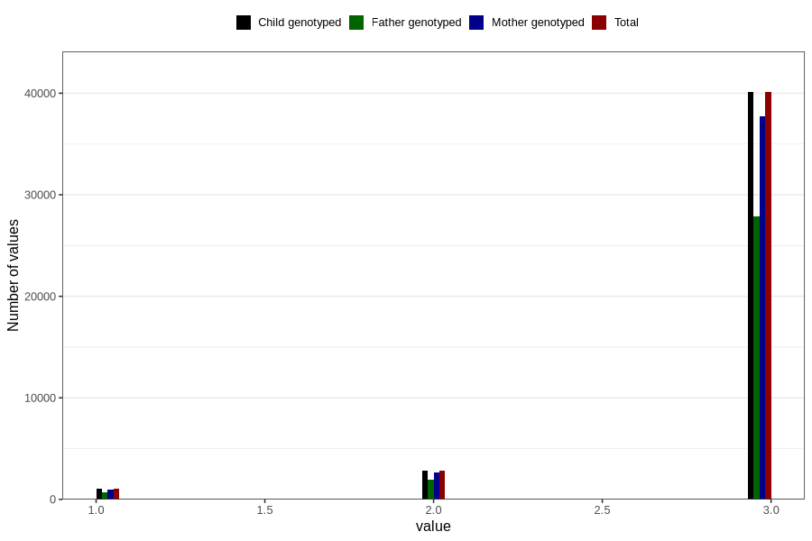

# vaccine_polio_freq_18m
Variable mapping to `EE956` in `Skjema5_18mnd_v12`.
- Number of values:

| Value | Total | Child genotyped | Mother genotyped | Father genotyped |
| ----- | ----- | --------------- | ---------------- | ---------------- |
| Missing | 36861 | 36861 | 34691 | 22690 |
| Non-missing | 43945 | 43945 | 41333 | 30473 |
| 1 | 1026 | 1026 | 947 | 681 |
| 2 | 2821 | 2821 | 2649 | 1907 |
| 3 | 40098 | 40098 | 37737 | 27885 |

