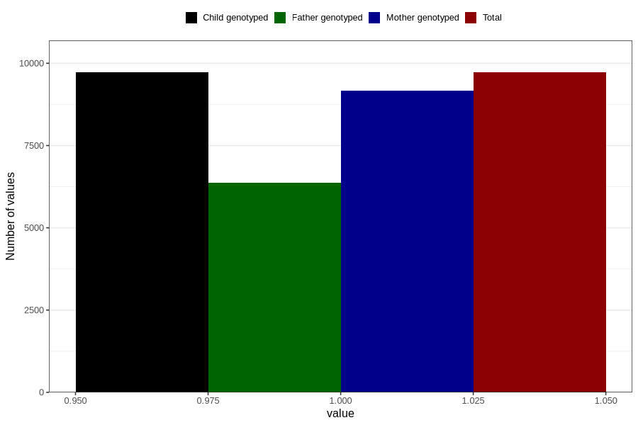

# breastmilk_15_18m
Variable mapping to `EE15` in `Skjema5_18mnd_v12`.
- Number of values:

| Value | Total | Child genotyped | Mother genotyped | Father genotyped |
| ----- | ----- | --------------- | ---------------- | ---------------- |
| Missing | 71085 | 71085 | 66848 | 46787 |
| Non-missing | 9721 | 9721 | 9176 | 6376 |
| 1 | 9721 | 9721 | 9176 | 6376 |

