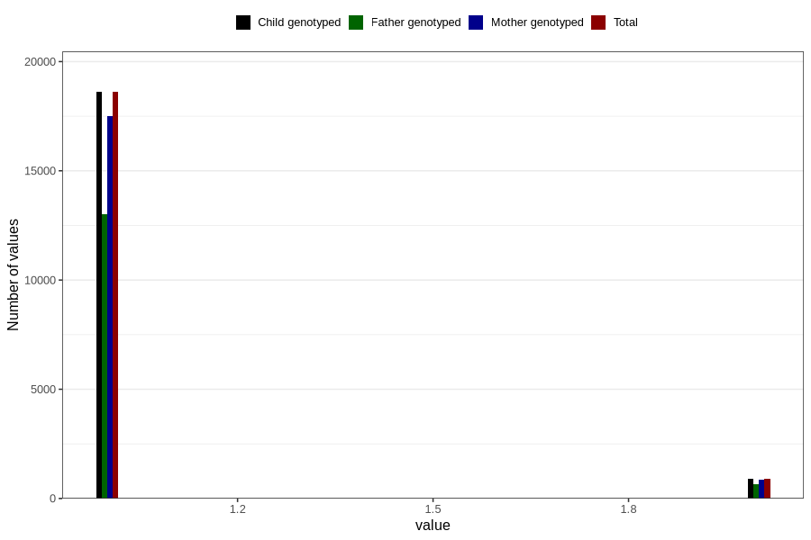

# fluoride_capsules_amount_per_time_7y
Variable mapping to `JJ540` in `Skjema7aar_v12`.
Variable mapping to `JJ540` in `Skjema7aar_v12`.
- Number of values:

| Value | Total | Child genotyped | Mother genotyped | Father genotyped |
| ----- | ----- | --------------- | ---------------- | ---------------- |
| Missing | 61272 | 61272 | 57642 | 39479 |
| Non-missing | 19534 | 19534 | 18382 | 13684 |
| 3+ at a time | 21 | 21 | 17 |16 |
| More than 1 check box filled in | 5 | 5 | 4 |4 |
| 1 | 18605 | 18605 | 17517 | 13027 |
| 2 | 903 | 903 | 844 | 637 |

