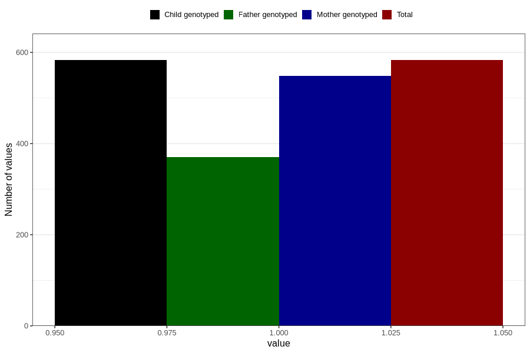

# formula_colett_1m
Variable mapping to `DD57` in `Skjema4_6mnd_v12`.
- Number of values:

| Value | Total | Child genotyped | Mother genotyped | Father genotyped |
| ----- | ----- | --------------- | ---------------- | ---------------- |
| Missing | 80223 | 80223 | 75475 | 52793 |
| Non-missing | 583 | 583 | 549 | 370 |
| 1 | 583 | 583 | 549 | 370 |

