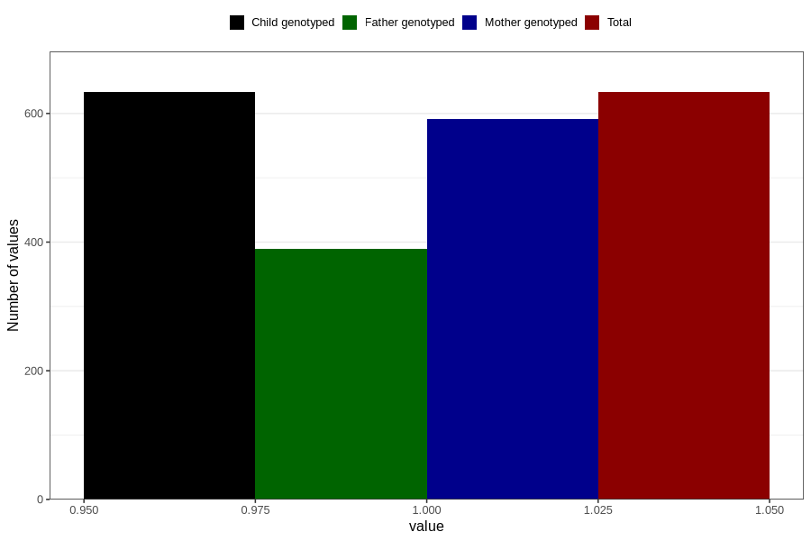

# formula_colett_2m
Variable mapping to `DD58` in `Skjema4_6mnd_v12`.
- Number of values:

| Value | Total | Child genotyped | Mother genotyped | Father genotyped |
| ----- | ----- | --------------- | ---------------- | ---------------- |
| Missing | 80173 | 80173 | 75433 | 52773 |
| Non-missing | 633 | 633 | 591 | 390 |
| 1 | 633 | 633 | 591 | 390 |

