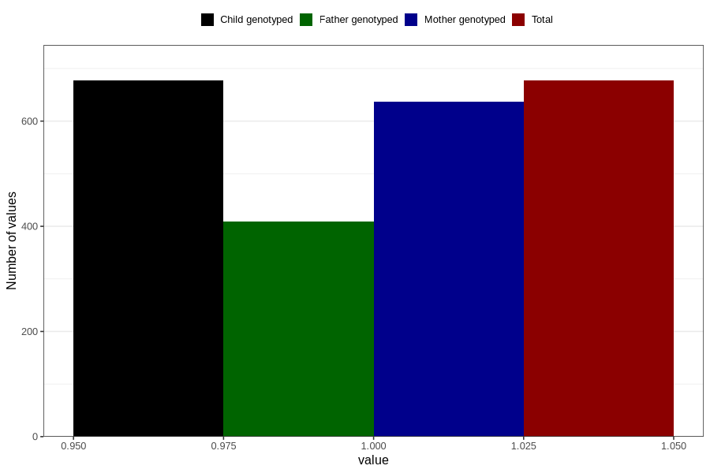

# formula_colett_3m
Variable mapping to `DD59` in `Skjema4_6mnd_v12`.
- Number of values:

| Value | Total | Child genotyped | Mother genotyped | Father genotyped |
| ----- | ----- | --------------- | ---------------- | ---------------- |
| Missing | 80129 | 80129 | 75387 | 52754 |
| Non-missing | 677 | 677 | 637 | 409 |
| 1 | 677 | 677 | 637 | 409 |

