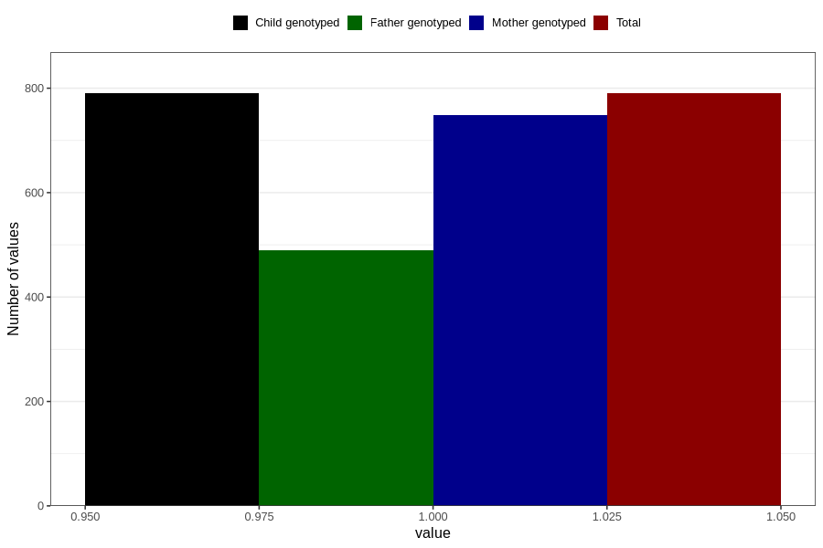

# formula_colett_4m
Variable mapping to `DD60` in `Skjema4_6mnd_v12`.
- Number of values:

| Value | Total | Child genotyped | Mother genotyped | Father genotyped |
| ----- | ----- | --------------- | ---------------- | ---------------- |
| Missing | 80016 | 80016 | 75275 | 52673 |
| Non-missing | 790 | 790 | 749 | 490 |
| 1 | 790 | 790 | 749 | 490 |

