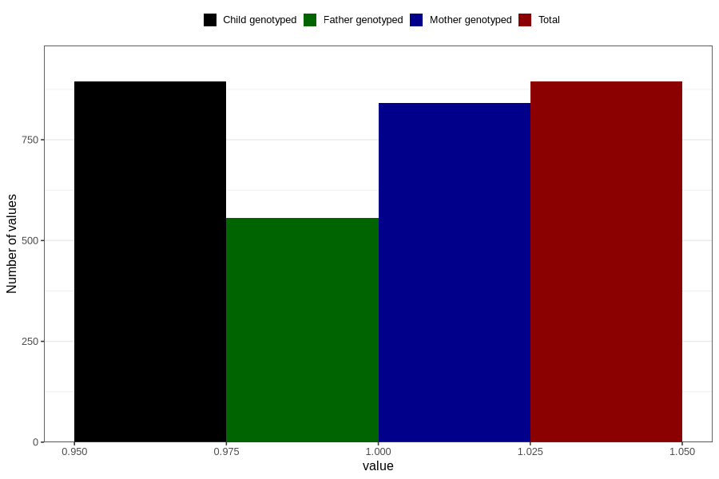

# formula_colett_5m
Variable mapping to `DD61` in `Skjema4_6mnd_v12`.
- Number of values:

| Value | Total | Child genotyped | Mother genotyped | Father genotyped |
| ----- | ----- | --------------- | ---------------- | ---------------- |
| Missing | 79912 | 79912 | 75182 | 52606 |
| Non-missing | 894 | 894 | 842 | 557 |
| 1 | 894 | 894 | 842 | 557 |

