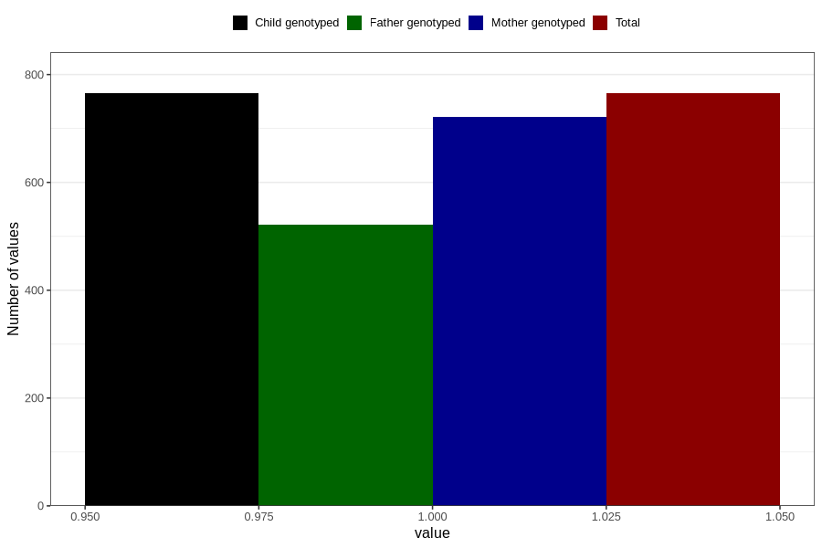

# formula_colett_6m
Variable mapping to `DD62` in `Skjema4_6mnd_v12`.
- Number of values:

| Value | Total | Child genotyped | Mother genotyped | Father genotyped |
| ----- | ----- | --------------- | ---------------- | ---------------- |
| Missing | 80041 | 80041 | 75302 | 52642 |
| Non-missing | 765 | 765 | 722 | 521 |
| 1 | 765 | 765 | 722 | 521 |

