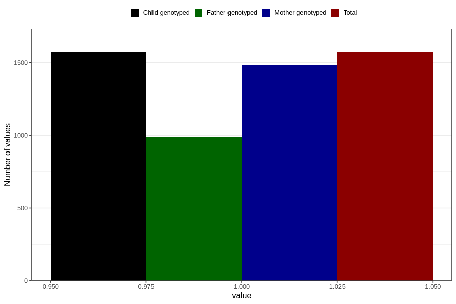

# formula_colett_omega3_1m
Variable mapping to `DD64` in `Skjema4_6mnd_v12`.
- Number of values:

| Value | Total | Child genotyped | Mother genotyped | Father genotyped |
| ----- | ----- | --------------- | ---------------- | ---------------- |
| Missing | 79231 | 79231 | 74540 | 52177 |
| Non-missing | 1575 | 1575 | 1484 | 986 |
| 1 | 1575 | 1575 | 1484 | 986 |

