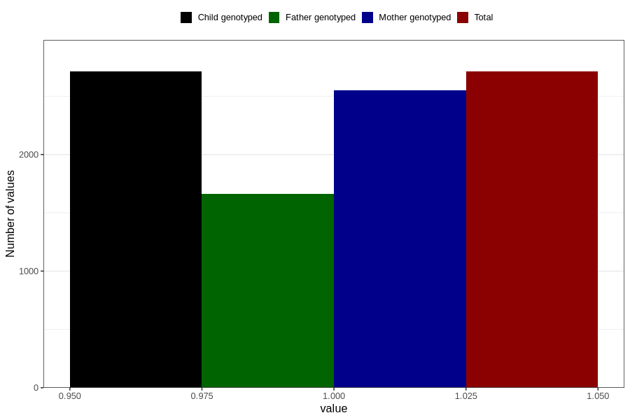

# formula_colett_omega3_3m
Variable mapping to `DD66` in `Skjema4_6mnd_v12`.
- Number of values:

| Value | Total | Child genotyped | Mother genotyped | Father genotyped |
| ----- | ----- | --------------- | ---------------- | ---------------- |
| Missing | 78095 | 78095 | 73475 | 51501 |
| Non-missing | 2711 | 2711 | 2549 | 1662 |
| 1 | 2711 | 2711 | 2549 | 1662 |

