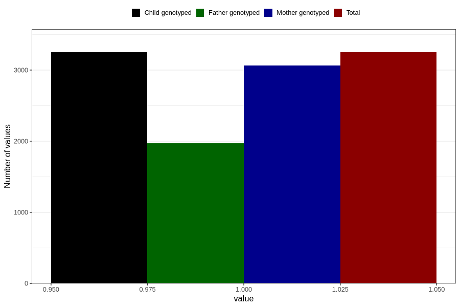

# formula_colett_omega3_4m
Variable mapping to `DD67` in `Skjema4_6mnd_v12`.
- Number of values:

| Value | Total | Child genotyped | Mother genotyped | Father genotyped |
| ----- | ----- | --------------- | ---------------- | ---------------- |
| Missing | 77557 | 77557 | 72958 | 51195 |
| Non-missing | 3249 | 3249 | 3066 | 1968 |
| 1 | 3249 | 3249 | 3066 | 1968 |

