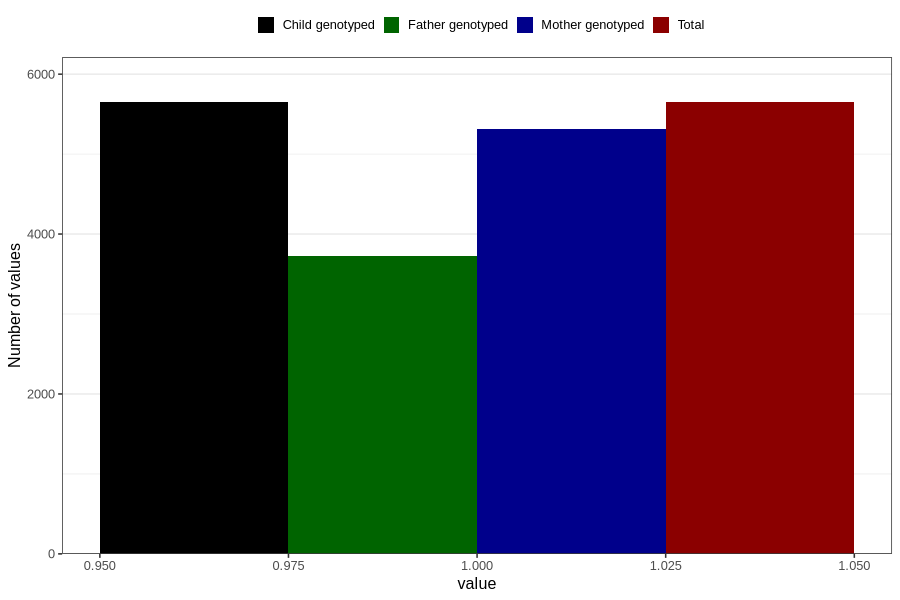

# formula_nan_0m
Variable mapping to `DD70` in `Skjema4_6mnd_v12`.
- Number of values:

| Value | Total | Child genotyped | Mother genotyped | Father genotyped |
| ----- | ----- | --------------- | ---------------- | ---------------- |
| Missing | 75158 | 75158 | 70713 | 49439 |
| Non-missing | 5648 | 5648 | 5311 | 3724 |
| 1 | 5648 | 5648 | 5311 | 3724 |

