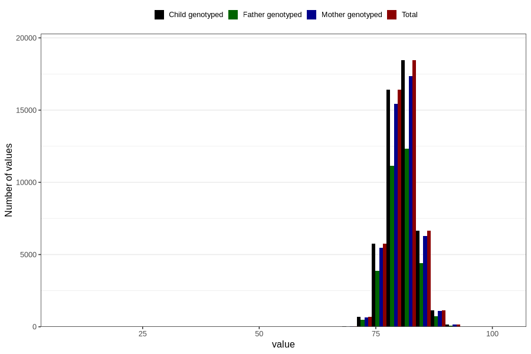

# length_15_18m_1
Variable mapping to `EE399` in `Skjema5_18mnd_v12`.
- Number of values:

| Value | Total | Child genotyped | Mother genotyped | Father genotyped |
| ----- | ----- | --------------- | ---------------- | ---------------- |
| Missing | 31496 | 31496 | 29541 | 20066 |
| Non-missing | 49310 | 49310 | 46483 | 33097 |
| 25th percentile | 78.5 | 78.5 | 78.5 | 78.5 |
| 50th percentile | 80.5 | 80.5 | 80.5 | 80.5 |
| 75th percentile | 82.5 | 82.5 | 82.6 | 82.5 |
| Mean | 80.6792983167715 | 80.6792983167715 | 80.6765570208463 | 80.6587757198538 |
| Standard deviation | 3.12005654414556 | 3.12005654414556 | 3.1310497971423 | 3.06276091118562 |
| N | 49310 | 49310 | 46483 | 33097 |

