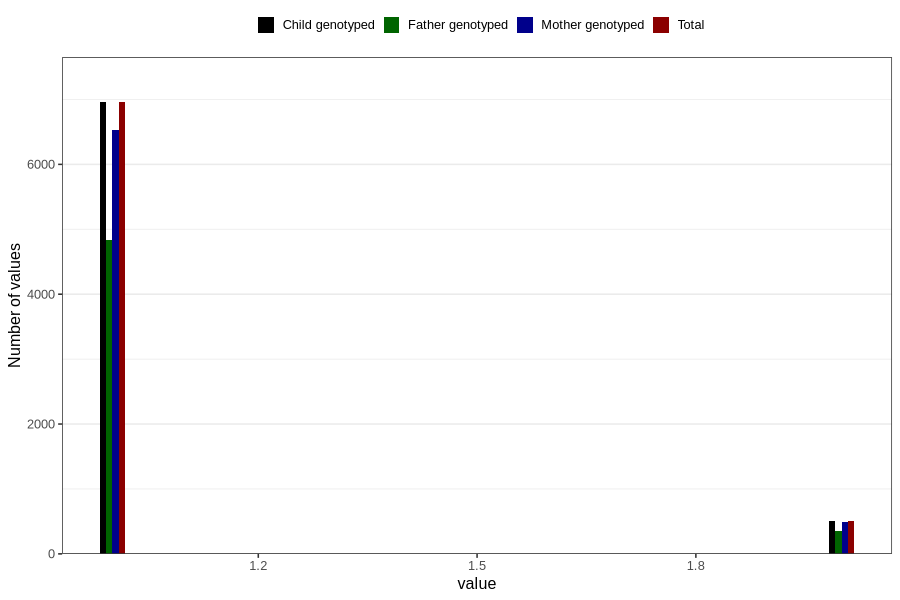

# multivitamins_capsules_amount_per_time_7y
Variable mapping to `JJ538` in `Skjema7aar_v12`.
Variable mapping to `JJ538` in `Skjema7aar_v12`.
- Number of values:

| Value | Total | Child genotyped | Mother genotyped | Father genotyped |
| ----- | ----- | --------------- | ---------------- | ---------------- |
| Missing | 73326 | 73326 | 68995 | 47964 |
| Non-missing | 7480 | 7480 | 7029 | 5199 |
| 3+ at a time | 15 | 15 | 14 |10 |
| More than 1 check box filled in | 3 | 3 | 3 |2 |
| 1 | 6956 | 6956 | 6528 | 4833 |
| 2 | 506 | 506 | 484 | 354 |

