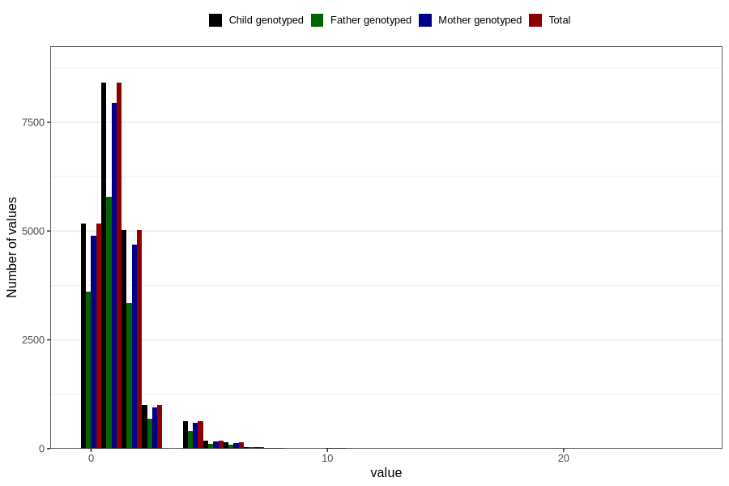

# n_slices_crisp_bread_7y
Variable mapping to `JJ342` in `Skjema7aar_v12`.
- Number of values:

| Value | Total | Child genotyped | Mother genotyped | Father genotyped |
| ----- | ----- | --------------- | ---------------- | ---------------- |
| Missing | 60148 | 60148 | 56568 | 39050 |
| Non-missing | 20658 | 20658 | 19456 | 14113 |
| 0 | 5179 | 5179 | 4892 | 3612 |
| 1 | 8406 | 8406 | 7950 | 5791 |
| 2 | 5018 | 5018 | 4697 | 3348 |
| 3 | 1011 | 1011 | 951 | 695 |
| 4 | 638 | 638 | 592 | 402 |
| 5 | 179 | 179 | 163 | 118 |
| 6 | 140 | 140 | 131 | 85 |
| 7 | 38 | 38 | 36 | 26 |
| 8 | 24 | 24 | 21 | 15 |
| 9 | 3 | 3 | 3 | 3 |
| 10 | 9 | 9 | 9 | 8 |
| 11 | 1 | 1 | 1 | 1 |
| 12 | 2 | 2 | 2 | 2 |
| 14 | 4 | 4 | 4 | 3 |
| 15 | 1 | 1 | 0 | 0 |
| 16 | 1 | 1 | 1 | 1 |
| 20 | 3 | 3 | 3 | 2 |
| 25 | 1 | 1 | 0 | 1 |

