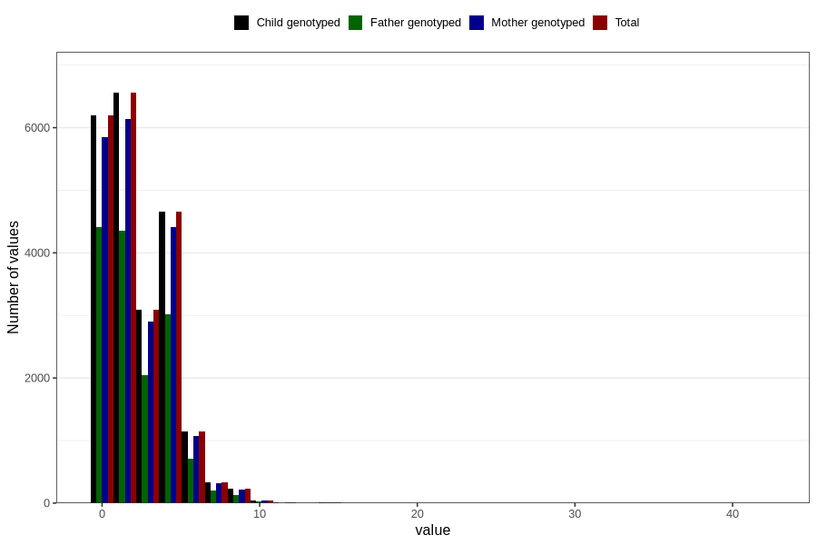

# n_slices_medium_refined_bread_daily_7y
Variable mapping to `JJ340` in `Skjema7aar_v12`.
- Number of values:

| Value | Total | Child genotyped | Mother genotyped | Father genotyped |
| ----- | ----- | --------------- | ---------------- | ---------------- |
| Missing | 58540 | 58540 | 55064 | 38257 |
| Non-missing | 22266 | 22266 | 20960 | 14906 |
| 25th percentile | 0 | 0 | 0 | 0 |
| 50th percentile | 2 | 2 | 2 | 2 |
| 75th percentile | 4 | 4 | 4 | 4 |
| Mean | 2.33562382107249 | 2.33562382107249 | 2.33649809160305 | 2.25036897893466 |
| Standard deviation | 2.09357644912006 | 2.09357644912006 | 2.09386215910898 | 2.06531430493508 |
| N | 22266 | 22266 | 20960 | 14906 |

