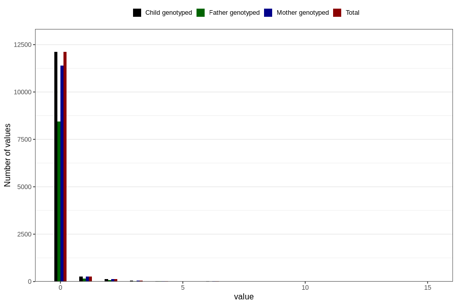

# n_slices_white_bread_daily_7y
Variable mapping to `JJ339` in `Skjema7aar_v12`.
- Number of values:

| Value | Total | Child genotyped | Mother genotyped | Father genotyped |
| ----- | ----- | --------------- | ---------------- | ---------------- |
| Missing | 68178 | 68178 | 64124 | 44417 |
| Non-missing | 12628 | 12628 | 11900 | 8746 |
| 0 | 12110 | 12110 | 11405 | 8435 |
| 1 | 277 | 277 | 264 | 163 |
| 2 | 135 | 135 | 129 | 83 |
| 3 | 47 | 47 | 45 | 28 |
| 4 | 35 | 35 | 34 | 21 |
| 5 | 9 | 9 | 8 | 7 |
| 6 | 10 | 10 | 10 | 6 |
| 7 | 2 | 2 | 2 | 1 |
| 8 | 1 | 1 | 1 | 1 |
| 10 | 1 | 1 | 1 | 1 |
| 15 | 1 | 1 | 1 | 0 |

