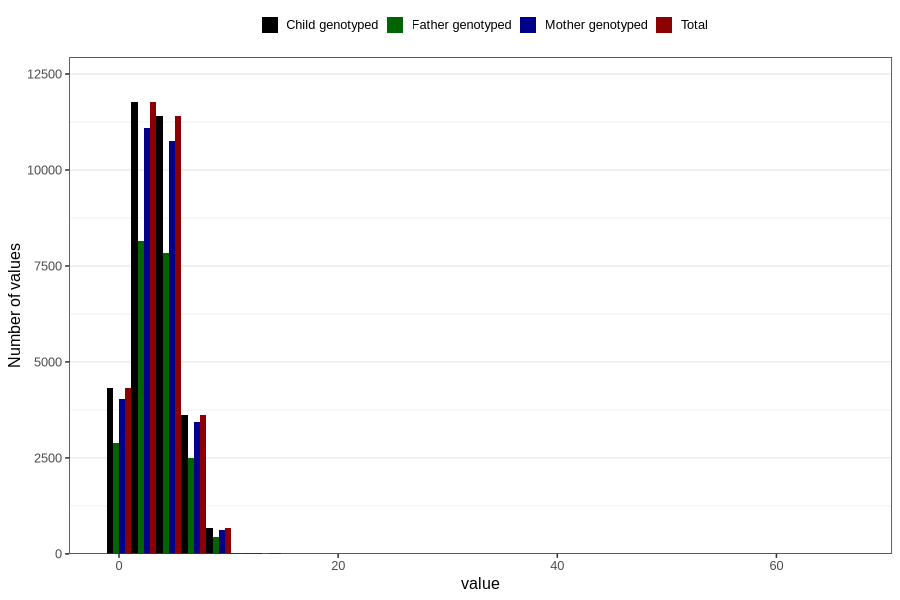

# n_slices_whole_grain_bread_7y
Variable mapping to `JJ341` in `Skjema7aar_v12`.
- Number of values:

| Value | Total | Child genotyped | Mother genotyped | Father genotyped |
| ----- | ----- | --------------- | ---------------- | ---------------- |
| Missing | 48960 | 48960 | 46040 | 31282 |
| Non-missing | 31846 | 31846 | 29984 | 21881 |
| 25th percentile | 2 | 2 | 2 | 2 |
| 50th percentile | 3 | 3 | 3 | 3 |
| 75th percentile | 5 | 5 | 5 | 5 |
| Mean | 3.48674872825473 | 3.48674872825473 | 3.48946104589114 | 3.49494995658334 |
| Standard deviation | 1.99240123405095 | 1.99240123405095 | 1.99628335658692 | 1.95850104009405 |
| N | 31846 | 31846 | 29984 | 21881 |

