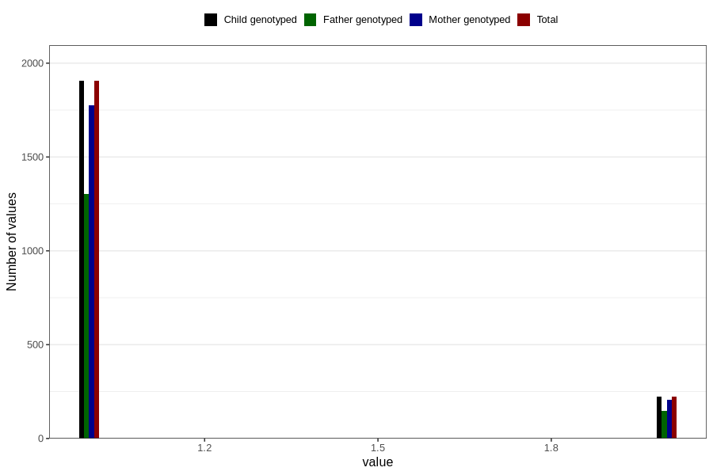

# other_supplement_capsules_amount_per_time_7y
Variable mapping to `JJ542` in `Skjema7aar_v12`.
Variable mapping to `JJ542` in `Skjema7aar_v12`.
- Number of values:

| Value | Total | Child genotyped | Mother genotyped | Father genotyped |
| ----- | ----- | --------------- | ---------------- | ---------------- |
| Missing | 78624 | 78624 | 73994 | 51684 |
| Non-missing | 2182 | 2182 | 2030 | 1479 |
| 3+ at a time | 54 | 54 | 47 |31 |
| More than 1 check box filled in | 2 | 2 | 2 |2 |
| 1 | 1905 | 1905 | 1776 | 1301 |
| 2 | 221 | 221 | 205 | 145 |

