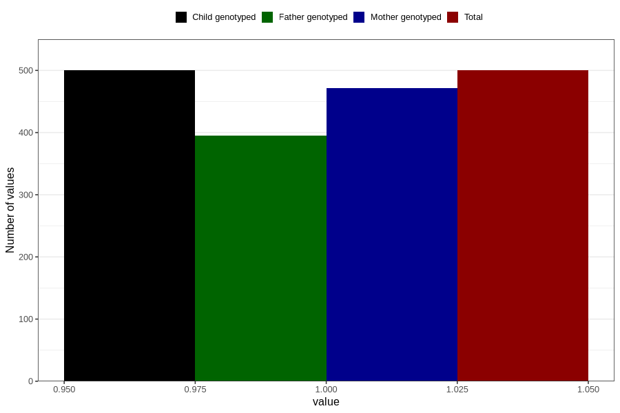

# father_diabetes
Variable mapping to `FF149` in `SkjemaFar_v12`.
- Number of values:

| Value | Total | Child genotyped | Mother genotyped | Father genotyped |
| ----- | ----- | --------------- | ---------------- | ---------------- |
| Missing | 80306 | 80306 | 75553 | 52768 |
| Non-missing | 500 | 500 | 471 | 395 |
| 1 | 500 | 500 | 471 | 395 |

