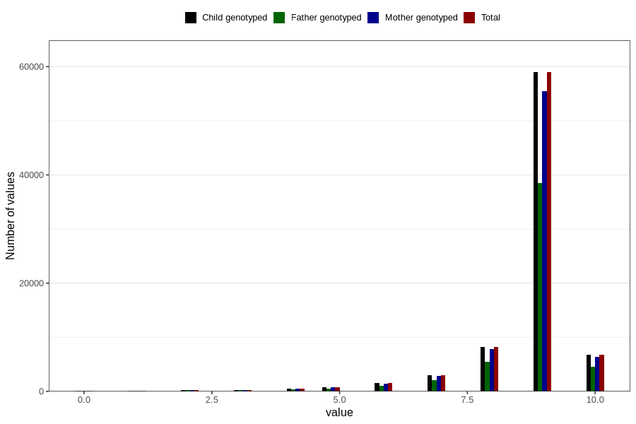

# apgar_1
Variable mapping to `APGAR1` in `MFR_541_v12`.
- Number of values:

| Value | Total | Child genotyped | Mother genotyped | Father genotyped |
| ----- | ----- | --------------- | ---------------- | ---------------- |
| Missing | 159 | 159 | 148 | 96 |
| Non-missing | 80647 | 80647 | 75876 | 53067 |
| 0 | 93 | 93 | 88 | 63 |
| 1 | 133 | 133 | 122 | 89 |
| 2 | 254 | 254 | 234 | 182 |
| 3 | 308 | 308 | 291 | 223 |
| 4 | 507 | 507 | 477 | 331 |
| 5 | 819 | 819 | 781 | 547 |
| 6 | 1554 | 1554 | 1441 | 1000 |
| 7 | 2987 | 2987 | 2812 | 2039 |
| 8 | 8270 | 8270 | 7767 | 5517 |
| 9 | 58955 | 58955 | 55506 | 38535 |
| 10 | 6767 | 6767 | 6357 | 4541 |

