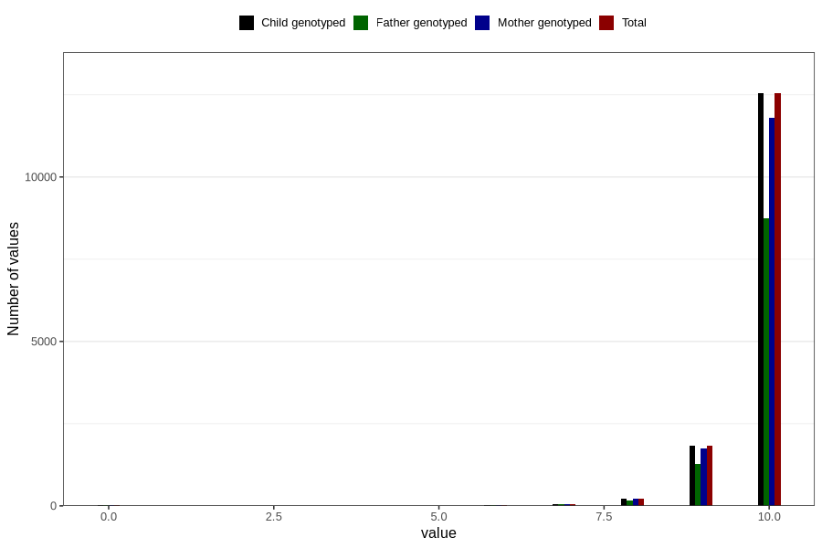

# apgar_10
Variable mapping to `APGAR10` in `MFR_541_v12`.
- Number of values:

| Value | Total | Child genotyped | Mother genotyped | Father genotyped |
| ----- | ----- | --------------- | ---------------- | ---------------- |
| Missing | 66075 | 66075 | 62153 | 42864 |
| Non-missing | 14731 | 14731 | 13871 | 10299 |
| 0 | 30 | 30 | 28 | 18 |
| 1 | 1 | 1 | 0 | 0 |
| 2 | 1 | 1 | 1 | 1 |
| 3 | 3 | 3 | 3 | 0 |
| 4 | 2 | 2 | 2 | 2 |
| 5 | 4 | 4 | 4 | 3 |
| 6 | 21 | 21 | 19 | 19 |
| 7 | 60 | 60 | 57 | 49 |
| 8 | 230 | 230 | 217 | 167 |
| 9 | 1838 | 1838 | 1739 | 1283 |
| 10 | 12541 | 12541 | 11801 | 8757 |

