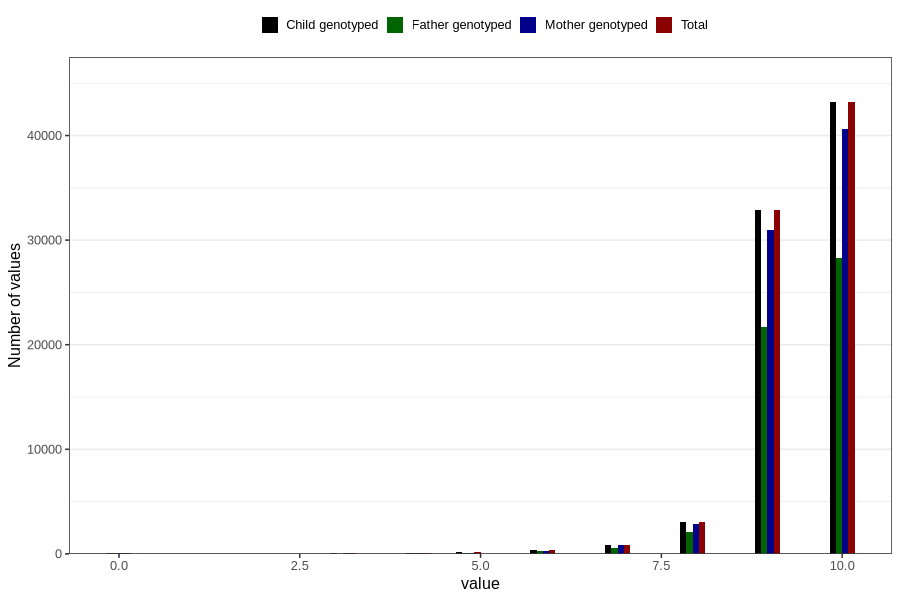

# apgar_5
Variable mapping to `APGAR5` in `MFR_541_v12`.
- Number of values:

| Value | Total | Child genotyped | Mother genotyped | Father genotyped |
| ----- | ----- | --------------- | ---------------- | ---------------- |
| Missing | 149 | 149 | 141 | 95 |
| Non-missing | 80657 | 80657 | 75883 | 53068 |
| 0 | 60 | 60 | 57 | 42 |
| 1 | 11 | 11 | 11 | 5 |
| 2 | 12 | 12 | 11 | 11 |
| 3 | 43 | 43 | 37 | 28 |
| 4 | 88 | 88 | 85 | 62 |
| 5 | 141 | 141 | 129 | 96 |
| 6 | 347 | 347 | 320 | 234 |
| 7 | 869 | 869 | 814 | 586 |
| 8 | 3039 | 3039 | 2839 | 2060 |
| 9 | 32868 | 32868 | 30920 | 21685 |
| 10 | 43179 | 43179 | 40660 | 28259 |

