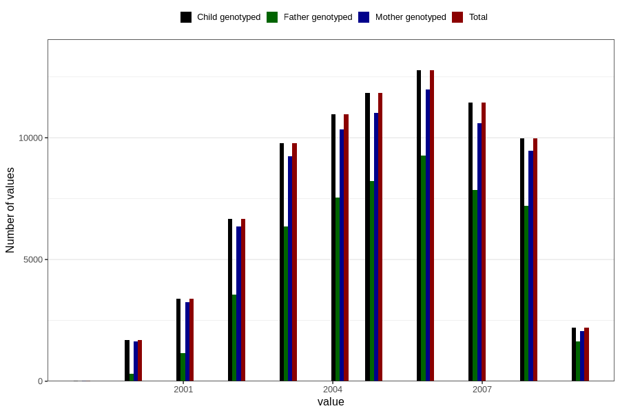

# birth_year
Variable mapping to `FAAR` in `MFR_541_v12`.
- Number of values:

| Value | Total | Child genotyped | Mother genotyped | Father genotyped |
| ----- | ----- | --------------- | ---------------- | ---------------- |
| Missing | 66 | 66 | 61 | 44 |
| Non-missing | 80740 | 80740 | 75963 | 53119 |
| 1999 | 29 | 29 | 27 | 6 |
| 2000 | 1679 | 1679 | 1626 | 295 |
| 2001 | 3401 | 3401 | 3261 | 1165 |
| 2002 | 6663 | 6663 | 6356 | 3545 |
| 2003 | 9777 | 9777 | 9232 | 6348 |
| 2004 | 10967 | 10967 | 10340 | 7542 |
| 2005 | 11838 | 11838 | 11027 | 8235 |
| 2006 | 12766 | 12766 | 11987 | 9274 |
| 2007 | 11447 | 11447 | 10590 | 7867 |
| 2008 | 9983 | 9983 | 9459 | 7216 |
| 2009 | 2190 | 2190 | 2058 | 1626 |

