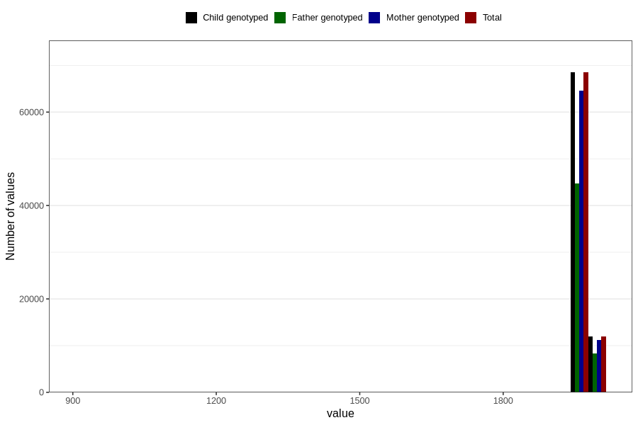

# father_birth_year
Variable mapping to `far_faar_trunkert` in `MFR_541_v12`.
- Number of values:

| Value | Total | Child genotyped | Mother genotyped | Father genotyped |
| ----- | ----- | --------------- | ---------------- | ---------------- |
| Missing | 246 | 246 | 221 | 58 |
| Non-missing | 80560 | 80560 | 75803 | 53105 |
| 25th percentile | 1968 | 1968 | 1968 | 1969 |
| 50th percentile | 1972 | 1972 | 1972 | 1973 |
| 75th percentile | 1976 | 1976 | 1976 | 1976 |
| Mean | 1971.22617924528 | 1971.22617924528 | 1971.19599488147 | 1971.98655493833 |
| Standard deviation | 25.2324935296868 | 25.2324935296868 | 25.1353406590032 | 16.17045995752 |
| N | 80560 | 80560 | 75803 | 53105 |

