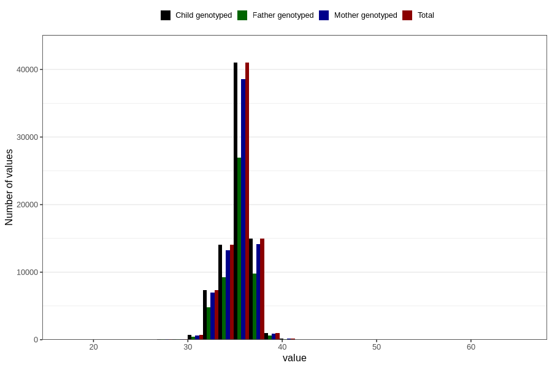

# hc_birth
Variable mapping to `HODE` in `MFR_541_v12`.
- Number of values:

| Value | Total | Child genotyped | Mother genotyped | Father genotyped |
| ----- | ----- | --------------- | ---------------- | ---------------- |
| Missing | 1334 | 1334 | 1247 | 891 |
| Non-missing | 79472 | 79472 | 74777 | 52272 |
| 25th percentile | 34 | 34 | 34 | 34 |
| 50th percentile | 35 | 35 | 35 | 35 |
| 75th percentile | 36 | 36 | 36 | 36 |
| Mean | 35.3089515804308 | 35.3089515804308 | 35.3077550583736 | 35.3076981940618 |
| Standard deviation | 1.58450881710618 | 1.58450881710618 | 1.58571910914261 | 1.58032481846525 |
| N | 79472 | 79472 | 74777 | 52272 |

