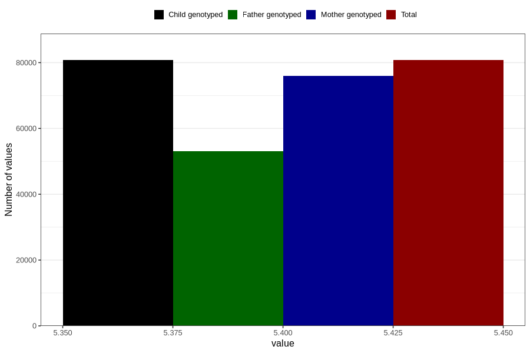

# mfr_record_version
Variable mapping to `VERSJON_RECORD` in `MFR_541_v12`.
- Number of values:

| Value | Total | Child genotyped | Mother genotyped | Father genotyped |
| ----- | ----- | --------------- | ---------------- | ---------------- |
| Missing | 66 | 66 | 61 | 44 |
| Non-missing | 80740 | 80740 | 75963 | 53119 |
| 5.41 | 80740 | 80740 | 75963 | 53119 |

