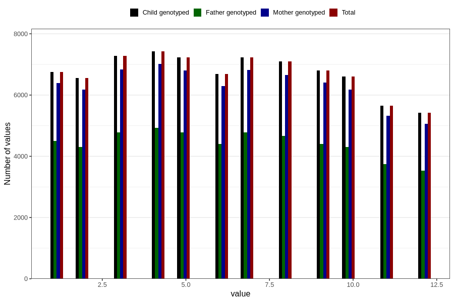

# month_of_delivery
Variable mapping to `FMND` in `MFR_541_v12`.
- Number of values:

| Value | Total | Child genotyped | Mother genotyped | Father genotyped |
| ----- | ----- | --------------- | ---------------- | ---------------- |
| Missing | 66 | 66 | 61 | 44 |
| Non-missing | 80740 | 80740 | 75963 | 53119 |
| 1 | 6761 | 6761 | 6396 | 4495 |
| 2 | 6556 | 6556 | 6179 | 4305 |
| 3 | 7280 | 7280 | 6840 | 4783 |
| 4 | 7423 | 7423 | 7016 | 4935 |
| 5 | 7226 | 7226 | 6799 | 4777 |
| 6 | 6683 | 6683 | 6300 | 4404 |
| 7 | 7232 | 7232 | 6813 | 4789 |
| 8 | 7096 | 7096 | 6658 | 4663 |
| 9 | 6806 | 6806 | 6401 | 4400 |
| 10 | 6608 | 6608 | 6182 | 4300 |
| 11 | 5654 | 5654 | 5319 | 3740 |
| 12 | 5415 | 5415 | 5060 | 3528 |

