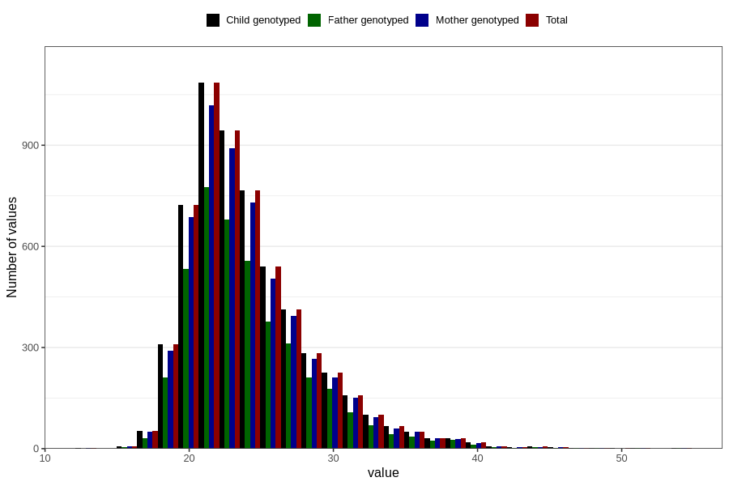

# mother_bmi_before
Variable mapping to `KMI_FOER` in `MFR_541_v12`.
- Number of values:

| Value | Total | Child genotyped | Mother genotyped | Father genotyped |
| ----- | ----- | --------------- | ---------------- | ---------------- |
| Missing | 74967 | 74967 | 70519 | 48960 |
| Non-missing | 5839 | 5839 | 5505 | 4203 |
| 25th percentile | 21.19 | 21.19 | 21.19 | 21.2 |
| 50th percentile | 23.14 | 23.14 | 23.14 | 23.18 |
| 75th percentile | 26.22 | 26.22 | 26.13 | 26.295 |
| Mean | 24.1727384826169 | 24.1727384826169 | 24.1469863760218 | 24.1872186533428 |
| Standard deviation | 4.37298340763649 | 4.37298340763649 | 4.33343117467389 | 4.32585384808671 |
| N | 5839 | 5839 | 5505 | 4203 |

