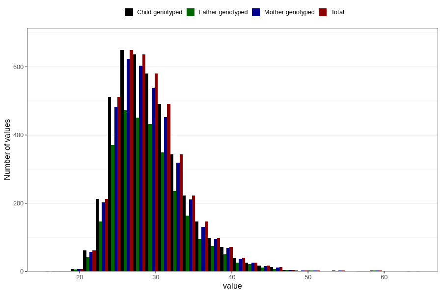

# mother_bmi_end
Variable mapping to `KMI_SLUTT` in `MFR_541_v12`.
- Number of values:

| Value | Total | Child genotyped | Mother genotyped | Father genotyped |
| ----- | ----- | --------------- | ---------------- | ---------------- |
| Missing | 76661 | 76661 | 72123 | 50201 |
| Non-missing | 4145 | 4145 | 3901 | 2962 |
| 25th percentile | 26.03 | 26.03 | 26.03 | 26.03 |
| 50th percentile | 28.63 | 28.63 | 28.52 | 28.61 |
| 75th percentile | 31.71 | 31.71 | 31.7 | 31.6 |
| Mean | 29.3140072376357 | 29.3140072376357 | 29.2883799025891 | 29.2997467927076 |
| Standard deviation | 4.66578279475003 | 4.66578279475003 | 4.65361220495419 | 4.6404035808839 |
| N | 4145 | 4145 | 3901 | 2962 |

