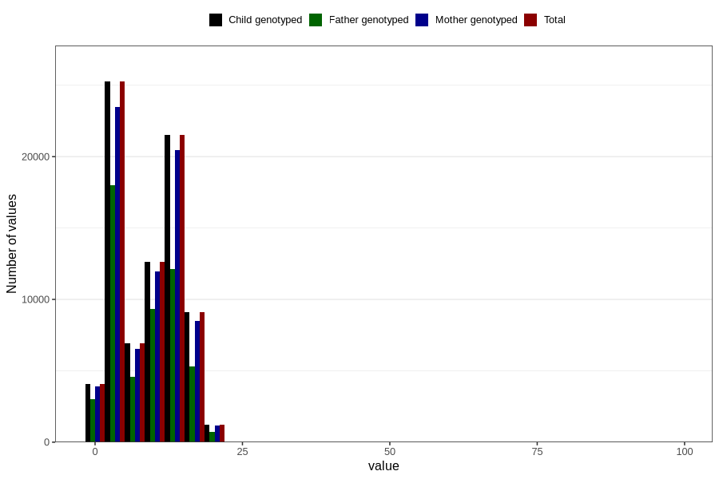

# mother_county_residence_delivery
Variable mapping to `BOFYLKE` in `MFR_541_v12`.
- Number of values:

| Value | Total | Child genotyped | Mother genotyped | Father genotyped |
| ----- | ----- | --------------- | ---------------- | ---------------- |
| Missing | 66 | 66 | 61 | 44 |
| Non-missing | 80740 | 80740 | 75963 | 53119 |
| 25th percentile | 3 | 3 | 3 | 3 |
| 50th percentile | 10 | 10 | 10 | 9 |
| 75th percentile | 12 | 12 | 12 | 12 |
| Mean | 8.83580629180084 | 8.83580629180084 | 8.8578255203191 | 8.38839210075491 |
| Standard deviation | 5.59092821956369 | 5.59092821956369 | 5.58853068826433 | 5.54824074017999 |
| N | 80740 | 80740 | 75963 | 53119 |

