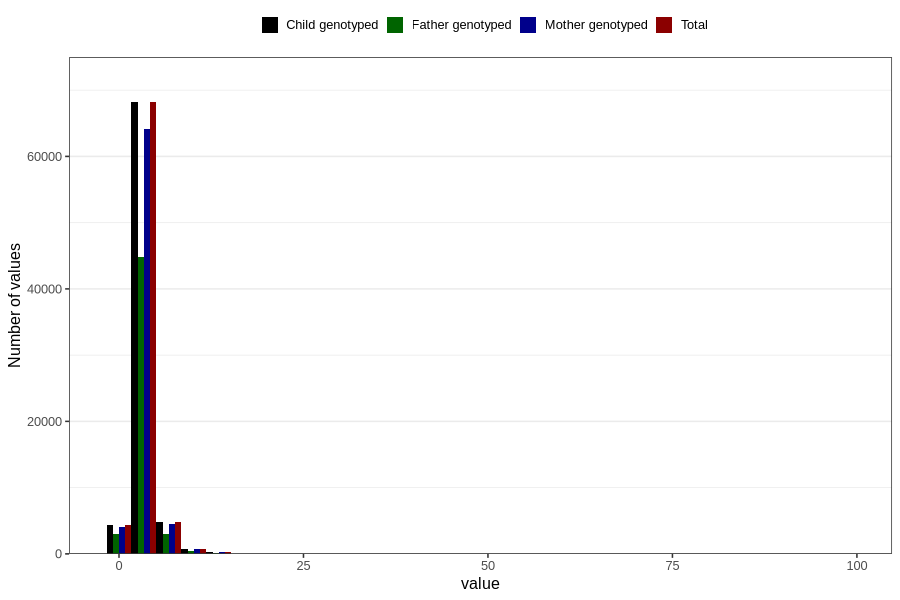

# mother_days_hospital_birth
Variable mapping to `LIGGEDOGN_MOR` in `MFR_541_v12`.
- Number of values:

| Value | Total | Child genotyped | Mother genotyped | Father genotyped |
| ----- | ----- | --------------- | ---------------- | ---------------- |
| Missing | 2469 | 2469 | 2277 | 1693 |
| Non-missing | 78337 | 78337 | 73747 | 51470 |
| 25th percentile | 3 | 3 | 3 | 2 |
| 50th percentile | 3 | 3 | 3 | 3 |
| 75th percentile | 4 | 4 | 4 | 4 |
| Mean | 3.44913642340146 | 3.44913642340146 | 3.45291333884768 | 3.3981348358267 |
| Standard deviation | 2.07455129435366 | 2.07455129435366 | 2.09023141315101 | 2.11262400465584 |
| N | 78337 | 78337 | 73747 | 51470 |

