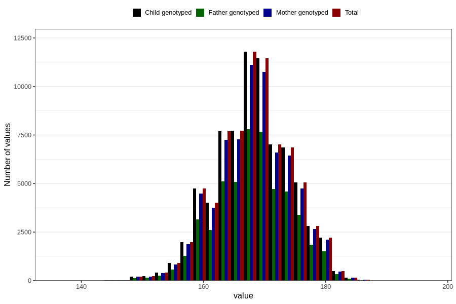

# mother_height
Variable mapping to `MORS_HOYDE` in `MFR_541_v12`.
Variable mapping to `MORS_HOYDE` in `MFR_541_v12`.
- Number of values:

| Value | Total | Child genotyped | Mother genotyped | Father genotyped |
| ----- | ----- | --------------- | ---------------- | ---------------- |
| Missing | 4974 | 4974 | 4640 | 2767 |
| Non-missing | 75832 | 75832 | 71384 | 50396 |
| 25th percentile | 164 | 164 | 164 | 164 |
| 50th percentile | 168 | 168 | 168 | 168 |
| 75th percentile | 172 | 172 | 172 | 172 |
| Mean | 168.175822871611 | 168.175822871611 | 168.178569427323 | 168.216882292245 |
| Standard deviation | 5.88952994146596 | 5.88952994146596 | 5.89211000218055 | 5.87914038164266 |
| N | 75832 | 75832 | 71384 | 50396 |

