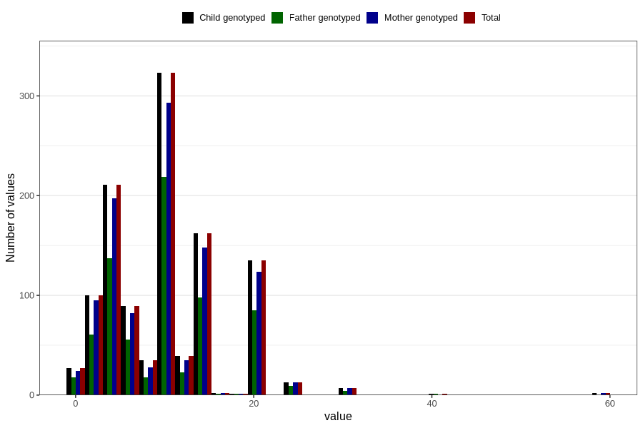

# mother_smoking_before_pregnancy_cigarettes_per_day
Variable mapping to `ROYK_FOER_ANT` in `MFR_541_v12`.
- Number of values:

| Value | Total | Child genotyped | Mother genotyped | Father genotyped |
| ----- | ----- | --------------- | ---------------- | ---------------- |
| Missing | 79659 | 79659 | 74973 | 52432 |
| Non-missing | 1147 | 1147 | 1051 | 731 |
| 25th percentile | 5 | 5 | 5 | 5 |
| 50th percentile | 10 | 10 | 10 | 10 |
| 75th percentile | 15 | 15 | 15 | 15 |
| Mean | 10.2371403661726 | 10.2371403661726 | 10.2169362511893 | 10.1299589603283 |
| Standard deviation | 6.20318402031398 | 6.20318402031398 | 6.22869997402415 | 5.84252876133961 |
| N | 1147 | 1147 | 1051 | 731 |

