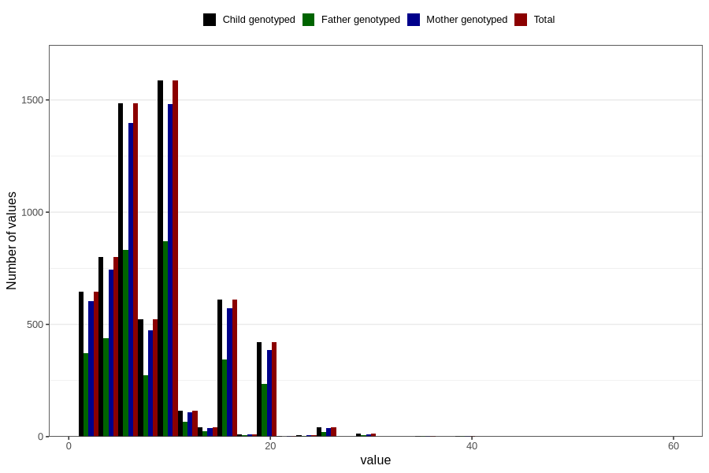

# mother_smoking_beginning_cigarettes_per_day
Variable mapping to `ROYK_BEG_ANT` in `MFR_541_v12`.
- Number of values:

| Value | Total | Child genotyped | Mother genotyped | Father genotyped |
| ----- | ----- | --------------- | ---------------- | ---------------- |
| Missing | 74499 | 74499 | 70141 | 49662 |
| Non-missing | 6307 | 6307 | 5883 | 3501 |
| 25th percentile | 5 | 5 | 5 | 5 |
| 50th percentile | 7 | 7 | 7 | 7 |
| 75th percentile | 10 | 10 | 10 | 10 |
| Mean | 8.38703028381164 | 8.38703028381164 | 8.36528981812001 | 8.37703513281919 |
| Standard deviation | 5.42313966953023 | 5.42313966953023 | 5.41111591829958 | 5.47582514655303 |
| N | 6307 | 6307 | 5883 | 3501 |

