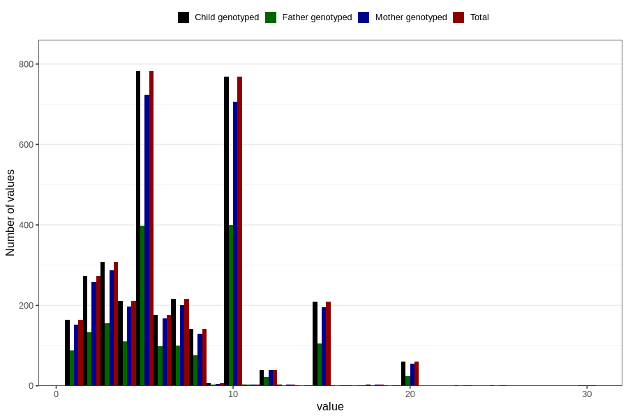

# mother_smoking_end_cigarettes_per_day
Variable mapping to `ROYK_AVSL_ANT` in `MFR_541_v12`.
- Number of values:

| Value | Total | Child genotyped | Mother genotyped | Father genotyped |
| ----- | ----- | --------------- | ---------------- | ---------------- |
| Missing | 77428 | 77428 | 72889 | 51440 |
| Non-missing | 3378 | 3378 | 3135 | 1723 |
| 25th percentile | 4 | 4 | 4 | 4 |
| 50th percentile | 5 | 5 | 5 | 5 |
| 75th percentile | 10 | 10 | 10 | 10 |
| Mean | 6.81468324452339 | 6.81468324452339 | 6.7993620414673 | 6.75333720255369 |
| Standard deviation | 4.12536703300024 | 4.12536703300024 | 4.11740584140325 | 3.99434620111749 |
| N | 3378 | 3378 | 3135 | 1723 |

